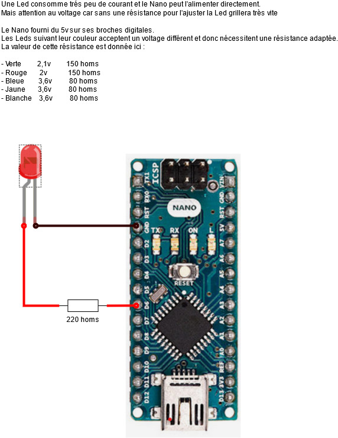
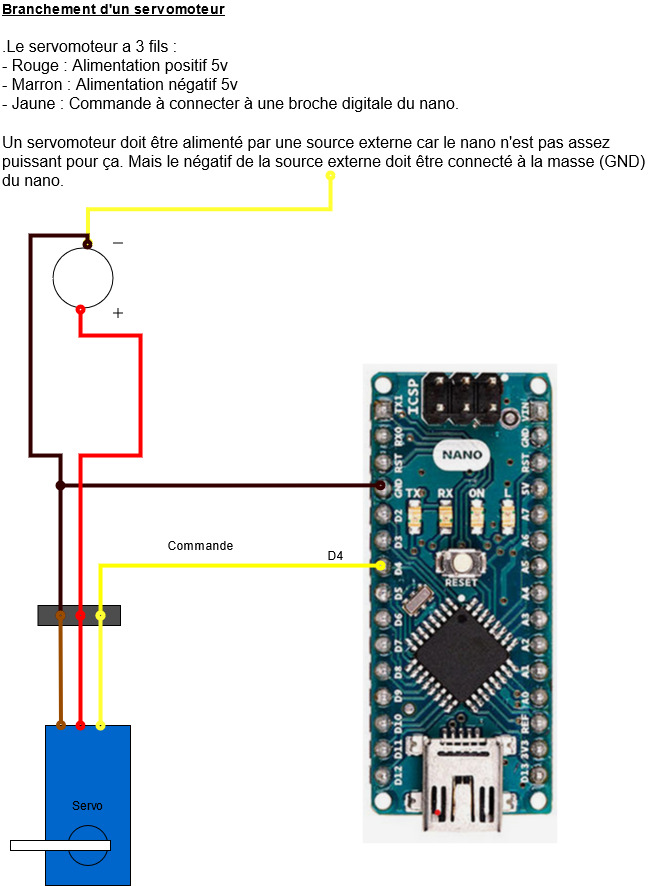

# Ardibot 

:toc:

Plateforme de découverte robotique pour les enfants de 7 à 77 ans

Quel merveilleux monde que celui de la robotique où la magie de l'informatique devient réelle à l'aide de moteurs, servos et autres capteurs.

Ardibot  est une plateforme ludique et colorée permettant  de programmer de façon simple différents montages allant de la simple led clignotante à des robots autonomes.

La programmation des périphériques a été simplifiée au maximum pour garder la partie ludique : la programmation du comportement. 

      @TODO Images de quelques réalisations

----------------

## Installation plateforme

Télécharger le zip de la plateforme depuis github et le dezipper sur votre disque.

* Url : https://github.com/tcou82/ardibot
* Déplier le bouton code
* Cliquer download zip et choisir enregistrer le fichier
* Une fois le téléchargement terminé ouvrir le dossier de téléchargement
* Faire click droit sur le fichier zip et choisir Extraire tout
* Choisir un emplacement sur le disque et cliquer sur extraire.

------------------

## Lancement de la plateforme

Double cliquer sur le fichier ardibot.cmd localisé à la racine du répertoire d'installation.

Pour faciliter le lancement vous pouvez ajouter un raccourci en faisant :
* click droit sur le fichier ardibot.cmd
* Envoyer vers > Bureau (Créer un raccourci)

------------------

## Les tutos des montages des periphériques

Avant de se lancer dans le montage et la programmation d'un robot il est conseillé de maîtriser les différents périphériques. Pour cela des ateliers tutos sont proposés où les montages sont expliqués en détails avec des schémas et les éléments de programmation sont abordés de façon progressive :

* tuto 1 : Débuter - Matériel de base et structure de programme pour un Arduino.  

* tuto 2 : LED - Faire clignoter une LED - Déclarer un périphérique.  
 

* tuto 3 : BUZZER - Faire des bips - Les variables.  

* tuto 4 : RELAIS - Commuter un circuit de puissance - Les conditions.  

* SERVO -  Manoeuvrer un servo - Les boucles.  

* MOTEUR - Activer un moteur - Les fonctions.  

### Les capteurs pour réagir avec le monde réel

* SONAR : Mesurer la distance avec un obstacle.  

* INTERRUPTEUR : Détecter l'état d'un bouton poussoir.  

### Les communications pour piloter le robot

* Bluetooth
* Com série

      @TODO 1 page par tuto

------------

## Les robots autonomes

### Handy - Le bras robotisé

#### Présentation

#### Montage

#### Activer les servos

### Walker - Robot marcheur

### Scoot - Robot motorisé  

